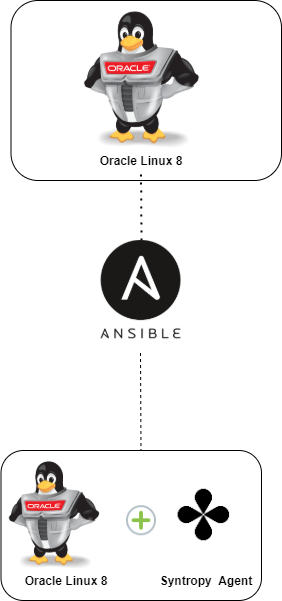

# Syntropy agent automatic installation with Ansible on Oracle Linux 8

This Ansible role is for the automated installation of Syntropy client for Oracle Linux 8 Distribution. This playbook allows to automatically connect to a Syntropy network.

Machine network traffic is being handled by Syntropy Agent connection - secure encrypted tunnels based on Wireguard.

Syntropy agent is deployed as a docker container.

<center>  </center>


## What is Syntropy?

The Syntropy Stack provides teams the ability to seamlessly create, automate, scale, and optimize encrypted connections between any devices or services running on a cloud, on-premise, or edge location.
Your team can use existing technologies in your stack to install and configure the Syntropy Agent to create connections between your endpoints, and monitor the health of those endpoints through the Syntropy UI.

## Requirements

- Oracle Linux 8 based distro
- Required dependencies installed & Ansible server configured. 
- You will also need to register for a Syntropy account here: https://platform.syntropystack.com
- Wireguard kernel module is required if you are running a kernel older than 5.6. More details here: https://docs.syntropystack.com/docs/start-syntropy-agent

## Dependencies

List of dependencies that will be installed with this playbook:

```
iperf3 - Performs real-time network throughput measurements.
iptraf - IP LAN monitor that generates various network statistics including TCP info. UDP counts, ICMP and OSPF information, Ethernet load info, node stats, IP checksum errors, and others.
smartmontools - Additional package for failure analysis { smartctl & smartd }
python3-pip -> Allows the use of pip3 package.
python3-setuptools - Extensions to the python-distutils for large or complex distributions, required for further usage of python libraries within Syntropy agent.
wireshark - Packet analyzer for failure analysis.
tcpdump - Packet analyzer for failure analysis.
python3-libselinux - Required lib for Docker & Ansible.
bind-utils - Bind-utils contains a collection of utilities for querying DNS (Domain Name System) name servers to find out information about Internet hosts.
dnf-utils - classic YUM utilities implemented as CLI shims on top of DNF.
zip & unzip - used to compress & decompress the files to reduce file size.
```

## How to run

Get it running by 3 steps explained below:

1) Register for Syntropy account and get API key with API token
2) Update variables in roles/syntropy-oracle/vars/main.yml
3) Run playbook oracle.yml

### Step1 - get Agent token

Full instructions on how to get agent token is here: https://docs.syntropystack.com/docs/get-your-agent-token

### Step2 - update variables

Update the variables in roles/syntropy-oracle/vars/main.yml:

- Deploy Syntropy agent:
  - api_key - API key for Syntropy Platform web UI
  - cloud_provider - https://docs.syntropystack.com/docs/syntropy-agent-variables for a list of providers
  - syntropy_tag - Your machine hostname
  - subnet - Auto-generated subnet for your docker app.


### Step3 - run playbook


Execute this command in your main Ansible directory:
```
ansible-playbook roles/roles/syntropy-oracle/tasks/main.yml

or if you wish to execute a specific step you can use --tags option for example

ansible-playbook roles/roles/syntropy-oracle/tasks/main.yml --tags docker_enable
```


Visit the Platform WEB UI to check your network: 

https://platform.syntropystack.com

Author:

Vytenis Jakubauskas
Vytenis@noia.network