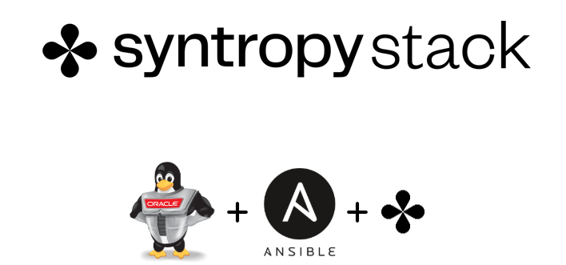

# Syntropy agent automatic installation with Ansible on Oracle Linux 8

This Ansible playbook is for automated installation of Syntropy client for Oracle Linux 8 Distribution. This playbook allows to automatically join connect to Syntropy network.

All the network traffic is being handled by Syntropy Agent connections - secure encrypted tunnels based on Wireguard. This network scheme is being managed by Syntropy Platform, which allows easily device connections and networks both using CLI and WEB UI.

Syntropy agent is deployed as a docker container.

<center></center>


## What is Syntropy?

Syntropy stack is software which lets you to easily establish VPN connections between remote endpoints, implement network-as-a-code approach and to avoid complex and inefficient network firewall and routing setups.

## Requirements

- Oracle Linux 8 based distro
- Required dependencies installed & Ansible server configured. 
- You will also need to register for a Syntropy account here: https://platform.syntropystack.com
- Wireguard kernel module is required if you are running kernel older than 5.6. More details here: https://docs.syntropystack.com/docs/start-syntropy-agent

## Dependencies

List of dependencies that will be installed with this playbook:

```
iperf3 - Performs real-time network throughput measurements.
iptraf - IP LAN monitor that generates various network statistics including TCP info. UDP counts, ICMP and OSPF information, Ethernet load info, node stats, IP checksum errors, and other.
smartmontools - Additional package for failure analysis { smartctl & smartd }
python3-pip -> Allows the use of pip3 package.
python3-setuptools - Extensions to the python-distutils for large or complex distributions, required for further usage of python libraries within Syntropy agent.
wireshark - Packet analyzer for a failure analysis.
tcpdump - Packet analyzer for a failure analysis.
python3-libselinux - Required lib for Docker & Ansible.
bind-utils - Bind-utils contains a collection of utilities for querying DNS (Domain Name System) name servers to find out information about Internet hosts.
dnf-utils - classic YUM utilities implemented as CLI shims on top of DNF.
zip & unzip - used to compress & decompress the files to reduce file size.
```

## How to run

Get it running by 3 steps explained below:

1) Register for Syntropy account and get API key with API token
2) Update variables in roles/syntropy-oracle/vars/main.yml
3) Run playbook oracle.yml

### Step1 - get API token and API key
You can create your API key at: https://platform.syntropystack.com

In order to get temporary API token:
```
git cexport SYNTROPY_API_SERVER=https://controller-prod-server.syntropystack.com
syntropyctl login your@account.com
Password: **********lone https://github.com/jpacekajus/syntropy-grafana-prometheus-node-exporter.git
```

### Step2 - update variables

Update the variables in roles/syntropy-oracle/vars/main.yml:

- Deploy Syntropy agent:
  - api_key - API key for Syntropy Platform web UI
  - cloud_provider - https://docs.syntropystack.com/docs/syntropy-agent-variables for a list of providers
  - syntropy_tag - Your machine hostname
  - subnet - Auto generated subnet for your docker app.


### Step3 - run playbook

Inside oracle.yml file:
```
---
- hosts: all { Defines that you can use this on any host you want }
  user: root { Defines the username with which Ansible connects to the remote host }

  roles:
  - role: syntropy-oracle { Defines the role that will be used if this playbook is executed }
    tags: oracle { Defines the tag of playbook steps. You can find more tags in the main.yml playbook itself. }
```


Execute this command in your main Ansible directory:
```
ansible-playbook oracle.yml

or if you wish to execute a specific step you can use --tags option for example

ansible-playbook oracle.yml --tags docker_enable
```


Visit the Platform WEB UI to check you network: 

https://platform.syntropystack.com

Author:

Vytenis Jakubauskas
Vytenis@noia.network
